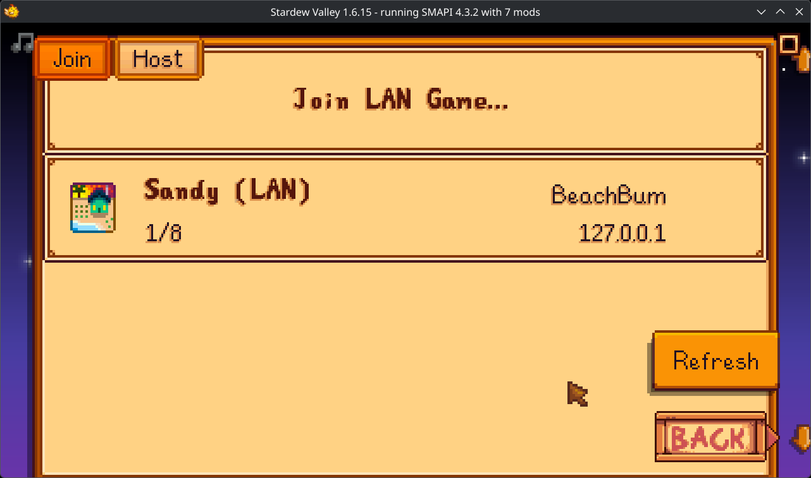
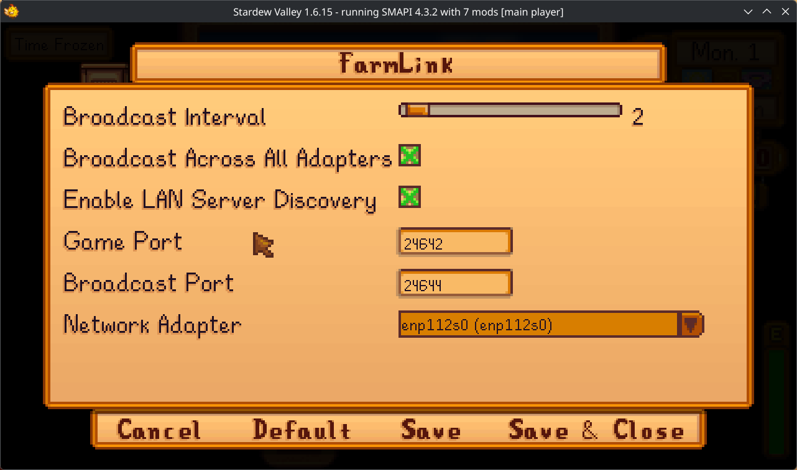

# FarmLink - Seamless LAN Discovery for Stardew Valley
**FarmLink** brings native-feeling LAN discovery to Stardew Valley. It eliminates the need to manually share and type IP addresses by automatically broadcasting hosted games to your local network and listing them directly in the Co-op menu.

## Features

### Seamless Co-op Menu Integration
Servers discovered on your network appear automatically in the Co-op -> Join -> LAN tab, just like standard Steam/GOG invites.

- **Zero Configuration:** Works out of the box for most users.
- **Rich Details:** Displays the Farm Name, Host Name, Player Count (e.g., 1/4), and the Server IP Address.
- **Visual Flair:** Shows the correct icon for the farm type (Standard, Beach, etc.), including support for Modded Farm Types.

  


### Smart Broadcasting
When you host a game, FarmLink acts as a beacon, announcing your server to other local FarmLink users.
- **VLAN Suppport:** Fully compatible with virtual LANs like ZeroTier, Hamachi, and Radmin VPN.
- **Multi-Interface:** Can be configured to broadcast across all network adapters simultaneously, ensuring you're visible regardless of complex network setups.

Real example of the exact packet that is broadcast:
```
{"Protocol":"StardewLAN","FarmName":"Sandy","HostName":"BeachBum","PlayerCount":"1/8","GameVersion":"1.6.15","Port":24642,"FarmTypeId":"6"}
```

### Configuration
FarmLink is fully integrated with **Generic Mod Config Menu (GMCM)** for easy in-game settings adjustment.



**Broadcast Interval:** Set the interval at which to announce the server/send the discovery packets (Default: 2 seconds).
**Broadcast Across All Interfaces:** Force the mod to shout on all available networks (useful for troubleshooting connection visibility)
**Enable LAN Scaning:** Toggles the listener/scanner functionality
**Broadcast Port:** (Advanced) Change the port used for discovery packets (Default: 24644)
**Game Port:** (Advanced) Ensure this matches your server's actual game port (Default:24642)
**Network Adapter:**  Select specifically which network interface to use (e.g. Ethernet vs Wi-Fi vs ZeroTier/Hamachi).

### How to Use

1. **Install** FarmLink on both the Host and Client computers.
2. **Host:** Start your Co-op farm as usual.
3. **Client:** Go to Co-op -> Join -> **Join LAN Game**.
4. Your host's farm will appear in the list. Click it to join!

### Compatibility

- Requires **Stardew Valley 1.6+** and **SMAPI 4.0+.**
- Works with **all modded farm types** (custom icons will load if provided by the mod author).
- Compatible* with **Split Screen** (*LAN scanning is auto-disabled in split-screen mode to prevent UI clutter).

Available on [NexusMods](https://www.nexusmods.com/stardewvalley/mods/41128)
